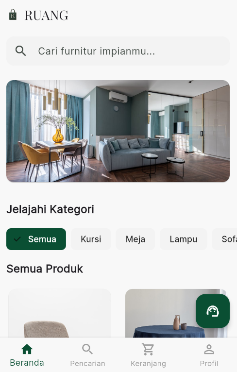

<div align="center">
  
  <h1><b>RUANG - Premium Furniture E-Commerce</b></h1>
  <p>Aplikasi e-commerce lintas platform yang kaya fitur, dibangun dengan Flutter dan Firebase.</p>
  <p>
    <a href="https://github.com/AlvindraRamadhan/E-commerce_Ruang/stargazers"></a>
    <a href="https://github.com/AlvindraRamadhan/E-commerce_Ruang/network/members"></a>
    <a href="https://github.com/AlvindraRamadhan/E-commerce_Ruang/pulls"></a>
    <a href="https://github.com/AlvindraRamadhan/E-commerce_Ruang/issues"></a>
  </p>
</div>

---

## 🚀 Versi Live

### **[https://ruang-app-668eb.web.app](https://ruang-app-668eb.web.app)**

---

## 📸 Tampilan Aplikasi

<p align="center">
  
</p>

---

## ✨ Fitur Unggulan

RUANG bukan sekadar aplikasi katalog, melainkan simulasi platform e-commerce modern yang fungsional dari awal hingga akhir.

#### 🛍️ **Alur E-Commerce Lengkap:**

- **Pencarian & Filter Lanjutan:** Pencarian _real-time_ dengan filter multi-kategori dan _slider_ rentang harga.
- **Manajemen Keranjang:** Fungsi tambah, perbarui, dan hapus item dari keranjang belanja.
- **Proses Checkout:** Alur _checkout_ multi-langkah, dari pemilihan alamat hingga ringkasan pesanan.
- **Integrasi Pembayaran:** Terhubung dengan **Midtrans Sandbox** untuk simulasi pembayaran yang aman.
- **Pembuatan Pesanan:** Pesanan baru secara otomatis dibuat di Firestore setelah pembayaran berhasil.

#### 👥 **Sistem Peran (Admin & Pengguna):**

- **Dasbor Admin:** Tampilan khusus untuk admin (`admin@ruang.com`) untuk melihat dan mengelola **semua** pesanan pengguna.
- **Manajemen Status Pesanan:** Admin dapat mengubah status pesanan (Diproses ➔ Dikirim ➔ Selesai) secara _real-time_.
- **Tampilan Terpisah:** Pengguna biasa hanya dapat melihat riwayat pesanan mereka sendiri, memastikan privasi data.

#### 🤖 **Asisten Virtual Cerdas (Gemini API):**

- **"Rara" AI Assistant:** _Chatbot_ yang didukung oleh **Google Gemini API** untuk menjawab pertanyaan pengguna seputar produk dan memberikan rekomendasi.
- **Konfigurasi Aman:** Kunci API disimpan dengan aman menggunakan **Firebase Remote Config**, bukan di dalam kode aplikasi.

#### 🌐 **Fitur Lainnya:**

- **Dukungan Multi-Bahasa:** Antarmuka yang sepenuhnya mendukung Bahasa Indonesia dan Bahasa Inggris.
- **Autentikasi Firebase:** Mendukung pendaftaran dan login menggunakan Email/Password serta Google Sign-In.
- **UI Profesional:** Desain yang bersih, modern, dan responsif, dengan animasi yang halus.

---

### 💳 **Panduan Mencoba Transaksi (Simulasi Midtrans)**

Karena aplikasi ini berjalan di web, browser modern memiliki kebijakan keamanan yang ketat (CORS Policy) yang dapat memblokir komunikasi antara aplikasi demo dengan server pembayaran Midtrans. Agar Anda bisa mencoba fitur pembayaran, ikuti langkah-langkah mudah di bawah ini.

**Langkah 1: Buka Browser dalam Mode Khusus**

Anda perlu menjalankan Google Chrome dengan mode keamanan web yang dinonaktifkan sementara. Ini **HANYA** untuk keperluan development dan mencoba demo ini.

- **Untuk Pengguna Windows:**

  1.  Buka **Command Prompt (CMD)**.
  2.  Salin dan tempel (copy-paste) perintah di bawah ini, lalu tekan Enter.
      ```bash
      start chrome --disable-web-security --user-data-dir="C:\DevChrome"
      ```

- **Untuk Pengguna macOS:**
  1.  Buka aplikasi **Terminal**.
  2.  Salin dan tempel (copy-paste) perintah di bawah ini, lalu tekan Enter.
      `bash
    open -na "Google Chrome" --args --disable-web-security --user-data-dir="$HOME/DevChrome"
    `
      > Perintah ini akan membuka jendela Google Chrome baru yang terpisah dan aman untuk pengujian.

**Langkah 2: Lakukan Transaksi di Aplikasi RUANG**

1.  Di jendela Chrome yang baru terbuka tadi, buka link demo aplikasi: **[https://ruang-app-668eb.web.app](https://ruang-app-668eb.web.app)**
2.  Lakukan proses pembelian seperti biasa hingga muncul halaman pembayaran Midtrans (misalnya, pembayaran via Virtual Account BCA).
3.  Salin **nomor Virtual Account** yang muncul di layar.

**Langkah 3: Bayar di Simulator Midtrans**

1.  Buka tab baru di browser yang sama dan kunjungi situs simulator Midtrans: **[https://simulator.sandbox.midtrans.com/](https://simulator.sandbox.midtrans.com/)**
2.  Tempelkan nomor Virtual Account yang sudah Anda salin tadi.
3.  Klik tombol "Pay". Status pembayaran di aplikasi RUANG akan otomatis berubah menjadi **berhasil** dan pesanan Anda akan diproses.

**Langkah 4 (Opsional): Kelola Pesanan sebagai Admin**

1.  Login ke aplikasi RUANG menggunakan akun admin:
    - **Email:** `admin@ruang.com`
    - **Password:** `123456`
2.  Dari dasbor admin, Anda bisa mengubah status pesanan yang baru saja dibuat dari "Diproses" menjadi "Dikirim" hingga "Selesai".

---

## 🛠️ Tumpukan Teknologi (Tech Stack)

| Kategori               | Teknologi                                                              |
| :--------------------- | :--------------------------------------------------------------------- |
| **Framework**          | Flutter 3.x                                                            |
| **Bahasa**             | Dart                                                                   |
| **Backend & Database** | **Firebase:** Authentication, Firestore, Hosting, Remote Config        |
| **Manajemen State**    | Provider                                                               |
| **API Pihak Ketiga**   | Google Gemini API, Midtrans API                                        |
| **Paket Utama**        | `google_generative_ai`, `cloud_firestore`, `firebase_auth`, `provider` |

---

## 🚀 Cara Menjalankan Proyek

1.  **Clone Repositori:**

    ```bash
    git clone [https://github.com/AlvindraRamadhan/E-commerce_Ruang.git](https://github.com/AlvindraRamadhan/E-commerce_Ruang.git)
    cd E-commerce_Ruang
    ```

2.  **Setup Firebase:**

    - Buat proyek baru di [Firebase Console](https://console.firebase.google.com/).
    - Ikuti instruksi untuk menambahkan aplikasi Flutter dan unduh file `firebase_options.dart` ke dalam folder `lib/`.
    - Aktifkan layanan **Authentication** (Email/Password, Google) dan **Firestore Database**.

3.  **Setup Google AI & Remote Config:**

    - Dapatkan **API Key** dari [Google AI Studio](https://aistudio.google.com/).
    - Buka **Firebase Remote Config** di proyek Anda.
    - Buat parameter baru dengan nama `gemini_api_key` dan masukkan API Key Anda sebagai nilainya, lalu _Publish changes_.

4.  **Install Dependensi:**

    ```bash
    flutter pub get
    ```

5.  **Jalankan Aplikasi:**
    ```bash
    flutter run
    ```
